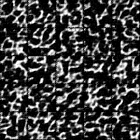

# VQ-DRAW

**VQ-DRAW** is a [vector quantized](https://en.wikipedia.org/wiki/Vector_quantization) [auto-encoder](https://en.wikipedia.org/wiki/Autoencoder) which encodes inputs in a sequential way similar to the [DRAW](https://arxiv.org/abs/1502.04623) architecture. Unlike [VQ-VAE](https://arxiv.org/abs/1711.00937), it can generate good samples without learning an autoregressive prior on top of the dicrete latents.

In addition to this write-up and the code, I've provided notebooks to play around with some small pre-trained models. These are intended to be runnable on a desktop PC, even without any GPU. Here is a list:

 * [mnist_demo.ipynb](mnist_demo.ipynb) - generate samples and intermediate refinements from an MNIST model
 * [svhn_demo.ipynb](svhn_demo.ipynb) - like mnist_demo.ipynb, but for SVHN.
 * [mnist_classify.ipynb](mnist_classify.ipynb) - train an MNIST classifier on top of features from a pre-trained MNIST encoder.

# Related work

VQ-DRAW started out as a "deep" variant of my earlier [cluster boosting algorithm](https://github.com/unixpickle/seqtree#more-on-clusterboosting). Cluster boosting is a way of encoding vectors (e.g. images) as a sequence of integers, where each integer indexes a vector and all of the resulting vectors are summed together. Cluster boosting has the limitation that the vectors corresponding to the latent integers are fixed; they do not depend on previous integers in the sequence. Thus, the latent codes have some amount of redundancy that could be avoided. This results in poor samples and relatively large latent codes compared to VQ-DRAW.

Other work has attempted to train discrete VAEs. The [VQ-VAE paper](https://arxiv.org/abs/1711.00937) cites many of these works, and presents a new framework for training discrete VAEs with vector quantization. However, VQ-VAE models only tend to encode local "patches" into each latent integer. Random sampling of these latent codes results in outputs which are locally coherent but globally incoherent. This is why both VQ-VAE and [VQ-VAE-2](https://arxiv.org/abs/1906.00446) require autoregressive priors on top of the discrete latent representations.

Here is a visual example to show the local nature of VQ-VAE's latent codes. These are random samples from a VQ-VAE trained on MNIST with a 7x7 latent space and 32 options per latent. Note the local coherency (lines and curves) but the global incoherency (lack of fully-formed digits). (Trained via my [vq-vae-2](https://github.com/unixpickle/vq-vae-2) codebase).

Another line of related work stems from the [DRAW](https://arxiv.org/abs/1502.04623) architecture. DRAW works by sequentially generating an image using attention to modify part of the image at a time. Each timestep of the sequence has its own latent code which specifies what local modification to perform. The resulting sequence of latents is treated as one larger latent code for the entire image. While DRAW itself uses attention, follow-up work like [Convolutional DRAW](https://arxiv.org/abs/1604.08772) maintains the same sequential architecture but opts for an attention-free approach. The sequential aspect of VQ-DRAW is similar to DRAW, but the latent codes in VQ-DRAW are discrete and very small, and the neural network architectures used in VQ-DRAW are not recurrent.

# The VQ-DRAW algorithm

This section first describes the encoding/decoding process for a fully trained model. It then presents an algorithm for training such models in practice.

It should be noted that, unlike in DRAW, VQ-DRAW does not have a separate encoder and decoder network. A single network, referred to as the "refinement network", does the heavy lifting of both encoding and decoding.

## Encoding/Decoding

Both the encoding and decoding processes are sequential. Each timestep of these processes is referred to as a "stage". For ease of notation, the variable *N* refers to the total number of encoding/decoding stages.

The encoding process takes in a tensor and returns a latent code of integers, *[c1, ..., cN]*. The decoding process approximately reverses this transformation, taking in a latent code of integers and producing a reconstruction tensor.

During encoding, the algorithm keeps track of the target (i.e. the tensor to be encoded), and the current reconstruction. At the first stage, the current reconstruction always starts out the same, usually as some tensor of 0s. At each stage *i* of encoding, the refinement network proposes *K* variations of the current reconstruction. The variation with the lowest reconstruction error is chosen, and the index of this variation (from 1 to K) is saved as latent component *ci*. After *N* stages of encoding, we have latent components *[c1, ..., cN]*, forming the complete latent code. Thus, the latent code is *N log2(K)* bits.

Decoding proceeds in a similar fashion. The inputs to this algorithm are the latent components *[c1, ..., cN]*, and the output is a reconstruction tensor. The algorithm starts with the initial reconstruction tensor (all 0s). For decoding step *i=1* to *N*, it feeds the current reconstruction into the refinement network, selects the variation at index *ci*, and sets this variation as the new current reconstruction. After all *N* stages are performed, the current reconstruction tensor is returned.

It should be noted that the encoding process keeps track of the current reconstruction, and therefore gives us the reconstruction for free (i.e. with no extra compute). Thus, during training, no extra decoding step has to be performed.

## Training

First note that it is possible to backpropagate through the encoding process, assuming that the choices for each latent component remain fixed. In other words, the final reconstruction error is locally differentiable, and we can use SGD to minimize it. However, the gradient for a given data point will ignore most of the outputs of the refinement network, since a specific refinement is selected at each stage of the encoding process and the remaining refinements are ignored.

In particular, at stage *i*, the refinement network outputs refinements *[Ri,1, ..., Ri,k]*, and we select the best refinement and proceed to the next stage of encoding. The other refinements are not used and do not directly contribute to the final reconstruction loss. Furthermore, if refinement *Ri,j* is never used for any sample in the dataset (perhaps because it has a bad set of initial biases), then there will be no gradient signal to improve *Ri,j* so that it can be used for encodings later on in training.

To solve the above problems, we can use a slightly modified objective. First, we directly minimize the reconstruction error for the chosen reconstruction **at every stage of encoding**. This was very beneficial in experiments, versus just optimizing the reconstruction error at the final encoding stage. Second, we introduce an auxiliary loss that minimizes a small coefficient times all of the reconstruction errors (even the unchosen ones): *α (R1,1 + ... + RN,K)*. Thus, if a refinement option *Ri,j* is never being used, it will gradually be pulled closer to the real refinement distribution until it finally is used to encode some sample in the dataset.

To track how well the refinements are distributed, we can look at the entropy of the distribution of latent components for single mini-batches. This metric is not perfect, but it does reveal when a model is not using many of its refinement options effectively. I have found that, with the objective function described above, the entropy typically rises very close to the theoretical limit of *log(K)* (although it cannot reach this limit with a finite batch size).

# Model architecture

The refinement network must take in a reconstruction and produce *K* refinements to this reconstruction. There are plenty of architectures that could serve this purpose, but I found two things to be universally beneficial:

 1. **Stage conditioning:** the input to the refinement network is not just the current reconstruction x, but rather a tuple `(x, stage)`. This way, the network can perform different sorts of refinements at different stages, focusing on more fine-grained details at later stages of encoding. This resulted in major improvements on CIFAR-10, where the refinement sequence is an order of magnitude larger than the sequences for MNIST and SVHN.
 2. **Segmented models:** this is a special kind of conditioning, where entirely different refinement network parameters are used for different segments of stages. For example, the CIFAR experiments use a different network for each segment of 20 stages, so stages 1-20 are refined by a totally different set of network parameters than stages 20-40. This drastically improves reconstruction losses, which may either be caused by 1) the sheer number of extra parameters, 2) the refiner being able to focus on different aspects of the images at different parts of the encoding process. The later seems plausible, given the success of other stage conditioning mechanisms that don't introduce many additional parameters.

For all of my experiments, refinements are output as *residuals*. In other words, the network simply outputs deltas *[D1, ..., DK]* which are added to the current reconstruction R to produce refinements *[R + D1, ..., R + DK]*. This is motivated by the fact that roughly half of the deltas should have a positive dot product with the gradient of the reconstruction loss, so half of the refinements should be improvements (given small enough deltas).

## Images

For images, a natural architecture for the refinement network is a CNN which downsamples the image, processes it, and then upsamples it again with transposed convolutions. A final convolutional head produces *(K*C)* channels, where *K* is the number of refinements and *C* is the number of channels in the reconstructions. Thus, most of the architecture does not grow with *K*, only the final layer.

To condition CNN models on the stage index, there are layers after every convolution that multiply the channels by a per-stage mask vector. In particular, for every stage and convolutional layer, there is a different mask of shape [1 x C x 1 x 1] which is multiplied by the outputs of the convolutional layer.

In most of my CNN models, I use [group normalization](https://arxiv.org/abs/1803.08494) after every ReLU nonlinearity. I chose group normalization instead of [batch normalization](https://arxiv.org/abs/1502.03167) for two reasons: 1) group normalization makes it simpler to use bigger batches via gradient accumulation, 2) batch normalization might unfairly help the refinement network propose refinements appropriate for each particular mini-batch.

## Text

For text, I employ a network architecture similar to WaveNet, but with bi-directional dilated convolutions. **More details coming soon.**

# Future work

The VQ-DRAW algorithm, as presented here, uses a greedy choice at each stage of encoding. Perhaps encoding could be improved by using beam search or some other more intelligent criterion for choosing proposals from the refinement network.

Unlike VQ-VAE and many continuous VAE models, the computational cost of VQ-DRAW depends on the number of encoding stages. Thus, training VQ-DRAW on very complex data with tens of thousands of latent bits may be computationally difficult. To alleviate this dilemma, it may be beneficial to periodically distill segments of the encoding process into a single feed-forward network, essentially using the latent encodings from VQ-DRAW as supervised targets for a more efficient model.

Recent work in unsupervised learning, such as [CPC](https://arxiv.org/abs/1807.03748) and [SimCLR](https://arxiv.org/abs/2002.05709), do not rely on reconstructions at all. Instead, these methods aim to directly encode the mutual information between two different patches of the same image. This approach to unsupervised learning has been very fruitful for images, where reconstructions can focus too much on unimportant aspects of images. It may be possible to adapt the principles of VQ-DRAW (sequential encoding and vector quantization) to a contrastive predictive framework, procuding useful discrete latent codes for downstream classification tasks.
