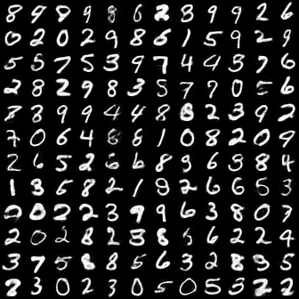
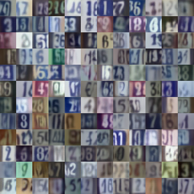
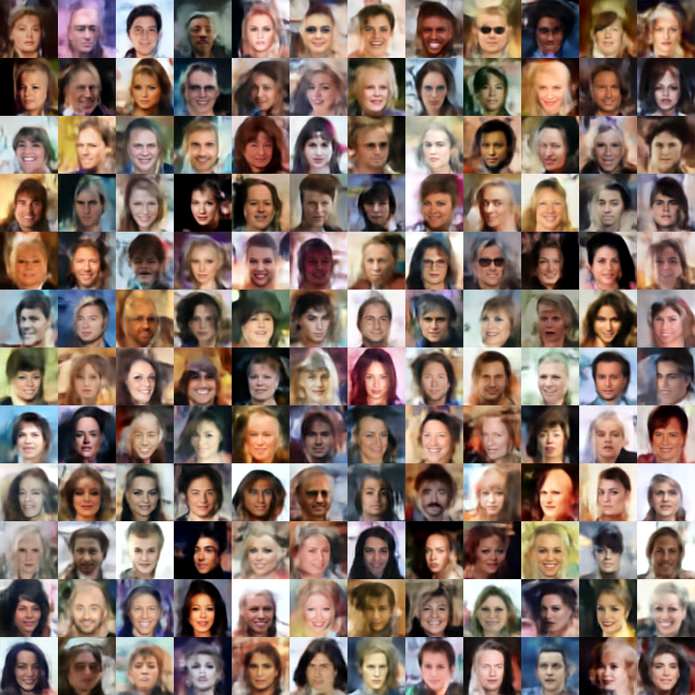
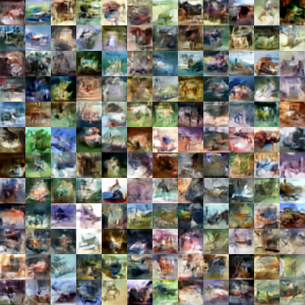
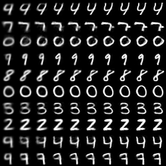
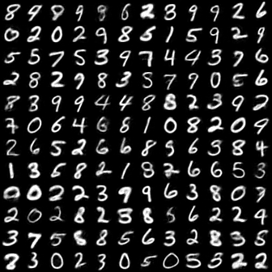

# VQ-DRAW

**VQ-DRAW** is a discrete [auto-encoder](https://en.wikipedia.org/wiki/Autoencoder) which encodes inputs in a sequential way similar to the [DRAW](https://arxiv.org/abs/1502.04623) architecture. Unlike [VQ-VAE](https://arxiv.org/abs/1711.00937), VQ-DRAW can generate good samples without learning an autoregressive prior on top of the dicrete latents.

This repository is still being used for active experimentation and research. See the [official-release](https://github.com/unixpickle/vq-draw/tree/official-release) branch for the version of the source code that came with the initial paper and blog post.

In addition to the code for training, I've provided notebooks to play around with some small pre-trained models. These are intended to be runnable on a desktop PC, even without any GPU. Here is a list:

 * [mnist_demo.ipynb](mnist_demo.ipynb) - generate samples and intermediate refinements from an MNIST model
 * [svhn_demo.ipynb](svhn_demo.ipynb) - like mnist_demo.ipynb, but for SVHN.
 * [mnist_classify.ipynb](mnist_classify.ipynb) - train an MNIST classifier on top of features from a pre-trained MNIST encoder.

# Dependencies

All of these experiments use PyTorch. I used Python 3.6.1, but future versions of Python should work as well. Here are package versions I used:

```
torch==1.4.0
torchvision=0.5.0
```

# Running experiments

These commands run the four experiments. Each command will periodically save the model as a `.pt` file; it will also save reconstructions and samples as images in the current directory. MNIST should run in an hour or two on a GPU. The other experiments may take up to a few days.

If you are running out of GPU memory, decrease the batch size by a factor of K and multiply the step interval and step limit by K. This will run an equivalent experiment with more gradient accumulation.

```
python -u train_mnist.py --batch 32 --step-limit 50000 --save-interval 500
python -u train_svhn.py --batch 32 --step-interval 16 --step-limit 70000 --save-interval 500
python -u train_cifar.py --batch 32 --step-interval 16 --step-limit 34811 --save-interval 500 --grad-checkpoint --lr-final 0.001
python -u train_celeba.py --batch 32 --step-interval 16 --step-limit 36194 --save-interval 500 --grad-checkpoint --lr-final 0.001
```

# Results

Here are samples from the trained VQ-DRAW models:

<table>
<tbody>
    <tr>
        <td></td>
        <td></td>
    </tr>
    <tr>
        <td></td>
        <td></td>
    </tr>
</tbody>
</table>

# How it works

The VQ-DRAW model reconstructs an image in stages, adding more details at every stage. Each stage adds a few extra bits of information to the latent code, allowing VQ-DRAW to make very good use of the latent information. Here is an example of 10 different MNIST digits being decoded stage by stage. In this example, each stage adds 6 bits:



Most of these images look pretty much complete after 5 stages (30 bits). Let's see how well 5 stages compare to 10 on a much larger set of samples:

Samples with 5 stages                |  Samples with 10 stages
:-----------------------------------:|:------------------------------------:
  |  
